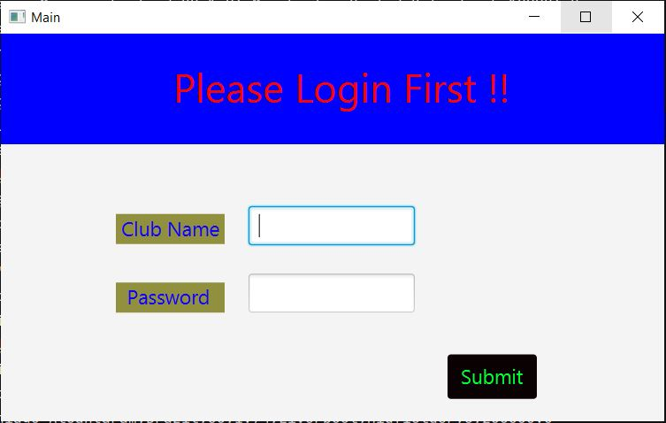
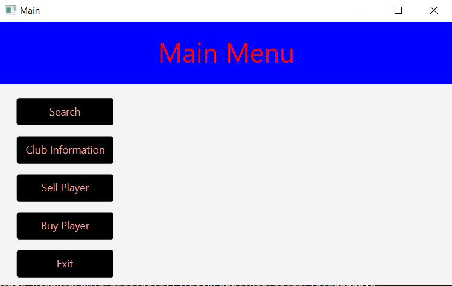
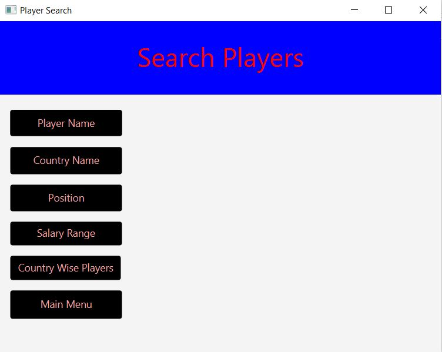
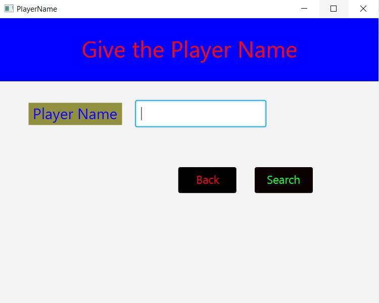
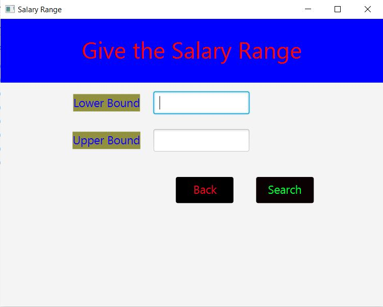
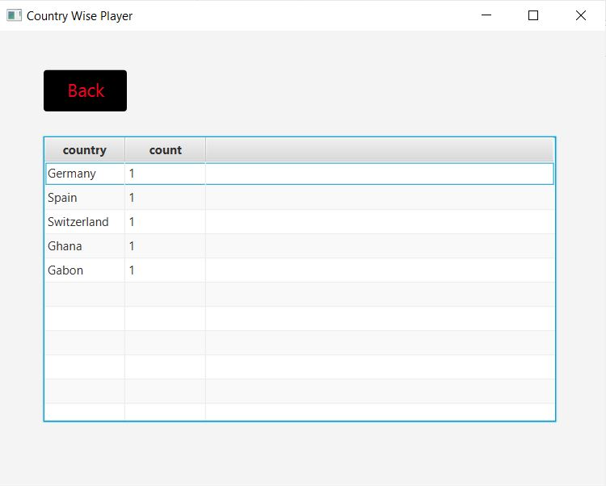
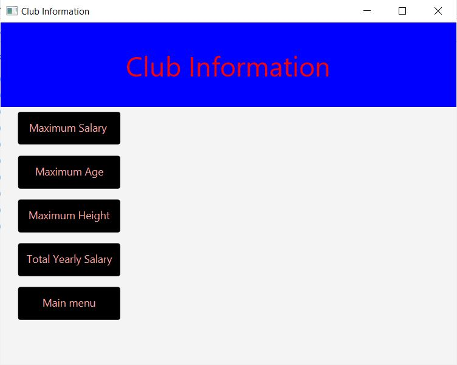
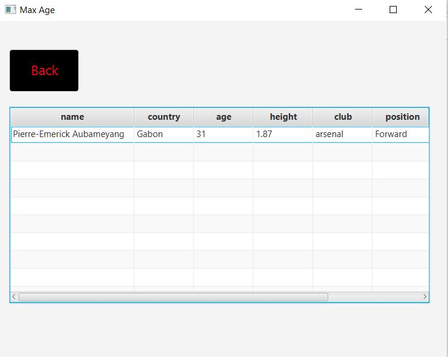
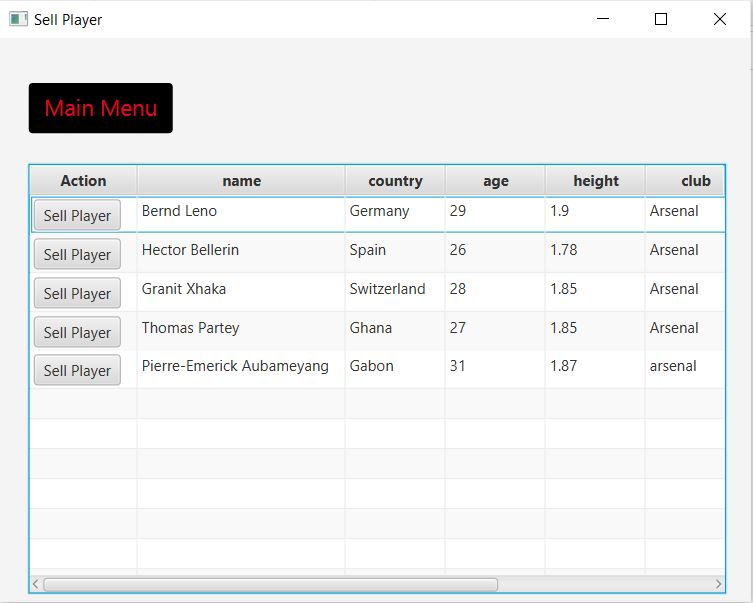
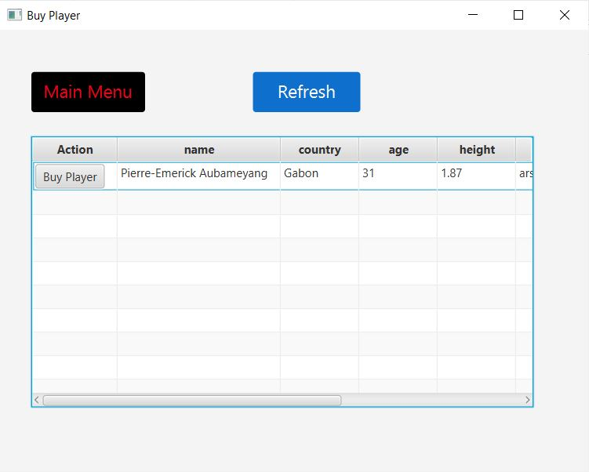

# Club and player transfer database management system
>It is a project to manage a football club. A manager can search players for various condition. A manager also can sell and buy players from other clubs. Actually It is a JavaFX application which connects a club to a local server, implemented using Java Networking.
---
# Feature of the project
>Login Page
>
>
>
>Home page
>
>
>
>Search Page
>
>
>
>Search by Player Name 
>
>
>
>Search by Salary
>
>
>
>Country Wise Player
>
>
>
>Club Information
>
>
>
>Most experienced player list of a club
>
>
>
>Sell Player Page
>
>
>
>Buy Player Page
>
>
>
# Getting the repository

1. Clone the repo
   ```sh
   git clone https://github.com/bijoy111/Term-Project-for-1-2.git
   ```

2. If you don't have git installed in your device then download zip and then unzip it.


# How to open the project
>You can check the youtube video given


# In case you face any problem
>Contact with me by email (bijoysaeem@gmail.com).
>Or you can google and get the solution.
